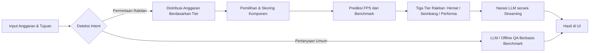

<div align="center">

# PCnerd ID

### Platform Perakit PC Berbasis Kecerdasan Buatan untuk Pasar Indonesia

**Rekomendasi komponen dari data nyata. Prediksi performa dari benchmark asli. Analisis mendalam dari AI.**

</div>

<div align="center">

[](https://nextjs.org)
[](https://react.dev)
[](https://www.typescriptlang.org)
[](https://tailwindcss.com)
[](https://www.prisma.io)
[](https://www.sqlite.org)

</div>

<div align="center">

[](<>)
[](<>)
[](<>)
[](<>)

</div>

---

## Daftar Isi

- [Mengapa PCnerd ID](#mengapa-pcnerd-id)
- [Fitur Utama](#fitur-utama)
- [Cara Kerja AI](#cara-kerja-ai)
- [Panduan Memulai](#panduan-memulai)
- [Referensi API](#referensi-api)
- [Struktur Proyek](#struktur-proyek)
- [Skrip yang Tersedia](#skrip-yang-tersedia)
- [Keamanan](#keamanan)
- [Catatan Operasional](#catatan-operasional)
- [Peta Jalan](#peta-jalan)

---

PCnerd ID adalah platform perakit PC yang dirancang khusus untuk pasar Indonesia. Setiap rekomendasi bukan sekadar estimasi: platform ini menggabungkan **data benchmark nyata**, **logika distribusi anggaran yang teruji**, dan **analisis naratif dari model bahasa besar (LLM)** untuk menghasilkan rakitan yang akurat, ekonomis, dan sesuai kebutuhan.

## Mengapa PCnerd ID

<table>
  <tr>
    <td align="center" width="33%">
      <h3>Akurasi Berbasis Data</h3>
      Skor komponen, prediksi FPS, dan analisis bottleneck didasarkan pada tolok ukur performa nyata dari 35 kartu grafis utama — bukan opini.
    </td>
    <td align="center" width="33%">
      <h3>Keandalan Harga</h3>
      Sinkronisasi harga langsung dari Tokopedia dan Enterkomputer memastikan setiap rekomendasi sesuai kondisi pasar Indonesia hari ini.
    </td>
    <td align="center" width="33%">
      <h3>Pengalaman yang Mulus</h3>
      Dari percakapan AI hingga hasil rakitan tiga tingkat performa, seluruh alur dirancang agar mudah dipahami pemula maupun pembuat PC berpengalaman.
    </td>
  </tr>
</table>

---

## Fitur Utama

<table>
  <tr>
    <td align="center" width="33%">
      <h3>Rekomendasi Komponen Cerdas</h3>
      Distribusi anggaran otomatis per tingkat harga dan kebutuhan (Gaming, Editing, Streaming, Office).
    </td>
    <td align="center" width="33%">
      <h3>Prediksi Performa Nyata</h3>
      Data FPS untuk 35 kartu grafis (RTX 5090 hingga GT 730) pada 1080p, 1440p, dan 4K untuk AAA Games dan E-Sports.
    </td>
    <td align="center" width="33%">
      <h3>Analisis AI Naratif</h3>
      Narasi rakitan dari OpenAI, Anthropic, atau LM Studio lokal, dialirkan karakter demi karakter secara real-time.
    </td>
  </tr>
  <tr>
    <td align="center" width="33%">
      <h3>Chat AI dengan Deteksi Intent</h3>
      Sistem membedakan permintaan rakitan, pertanyaan hardware, perbandingan, hingga percakapan di luar topik.
    </td>
    <td align="center" width="33%">
      <h3>Konteks Percakapan</h3>
      Riwayat percakapan dipertahankan sehingga pertanyaan lanjutan dipahami dalam konteks diskusi sebelumnya.
    </td>
    <td align="center" width="33%">
      <h3>Fallback Offline</h3>
      Tanpa koneksi LLM, pertanyaan umum tetap dijawab melalui evaluasi berbasis aturan dengan data benchmark.
    </td>
  </tr>
  <tr>
    <td align="center" width="33%">
      <h3>Skoring Multi-Faktor</h3>
      Setiap komponen dinilai dari kompatibilitas, performa, nilai, dan reliabilitas dengan rincian per aspek.
    </td>
    <td align="center" width="33%">
      <h3>Kalkulator Dampak Upgrade</h3>
      Kandidat GPU, CPU, dan RAM ditampilkan dengan selisih FPS yang konkret dan visual yang mudah dibaca.
    </td>
    <td align="center" width="33%">
      <h3>Analisis Bottleneck</h3>
      Gauge keseimbangan CPU-GPU dengan rasio numerik dan zona seimbang yang menyesuaikan resolusi.
    </td>
  </tr>
  <tr>
    <td align="center" width="33%">
      <h3>Keamanan PSU</h3>
      Perhitungan TDP total dan verifikasi kecukupan wattase power supply secara otomatis.
    </td>
    <td align="center" width="33%">
      <h3>Sinkronisasi Harga Real-time</h3>
      Pembaruan harga dari Tokopedia (SearchProductV5Query + cadangan halaman produk) dan Enterkomputer, per kategori.
    </td>
    <td align="center" width="33%">
      <h3>Spesifikasi Periferal Terverifikasi</h3>
      Data spesifikasi monitor, keyboard, mouse, headset, dan speaker yang telah divalidasi, bukan placeholder.
    </td>
  </tr>
  <tr>
    <td align="center" width="33%">
      <h3>Dashboard Admin Terpadu</h3>
      Kelola komponen, pengaturan LLM, sinkronisasi harga, dan akun admin dalam satu antarmuka.
    </td>
    <td align="center" width="33%">
      <h3>Responsif Penuh</h3>
      Layout adaptif untuk seluruh ukuran layar dengan interaksi yang dioptimalkan untuk perangkat sentuh.
    </td>
    <td align="center" width="33%">
      <h3>Keamanan Berlapis</h3>
      Otentikasi JWT, pembatasan laju permintaan, deteksi prompt injection, dan sanitasi keluaran.
    </td>
  </tr>
</table>

---

## Cara Kerja AI

<details>
  <summary><b>Alur Sistem Rekomendasi</b></summary>



</details>

### 1. Deteksi Intent (`POST /api/ai/build-prompt`)

Satu endpoint menangani seluruh tipe percakapan:

- **Permintaan Rakitan** — pengguna menyebutkan anggaran dan tujuan, sistem menghasilkan tiga tier rakitan lalu mengarahkan ke halaman hasil.
- **Pertanyaan Umum** — seputar komponen dan perbandingan hardware dijawab oleh LLM dan ditampilkan langsung dalam percakapan.
- **Di Luar Topik** — filter berbasis aturan dan validasi LLM menolak pertanyaan yang tidak berkaitan dengan PC dengan pesan yang ramah.
- **Pertahanan Prompt Injection** — pola deteksi terpadu, dan setiap keluaran disanitasi untuk mencegah injeksi skrip.

> Saat penyedia LLM tidak dapat dijangkau, pertanyaan tetap dijawab melalui logika berbasis aturan dengan data benchmark.

### 2. Distribusi Anggaran

Pembagian anggaran mengikuti keputusan berbasis aturan berdasarkan tingkat harga dan tujuan penggunaan:

| Tingkat Anggaran | GPU | CPU | MB  | RAM | Storage | PSU | Case |
| ---------------- | --- | --- | --- | --- | ------- | --- | ---- |
| Di bawah Rp 8 jt | 20% | 35% | 12% | 10% | 8%      | 8%  | 7%   |
| Rp 8–18 jt       | 40% | 25% | 10% | 8%  | 7%      | 6%  | 4%   |
| Rp 18–35 jt      | 48% | 22% | 9%  | 7%  | 6%      | 5%  | 3%   |
| Rp 35 jt ke atas | 55% | 18% | 8%  | 7%  | 6%      | 3%  | 3%   |

Anggaran disesuaikan dengan tujuan penggunaan, misalnya peningkatan alokasi CPU untuk editing dan rendering, serta porsi periferal bila diminta.

### 3. Skoring Komponen Multi-Faktor

| Faktor         | Bobot | Metrik                                                  |
| -------------- | ----- | ------------------------------------------------------- |
| Kompatibilitas | 30%   | Kecocokan soket, tipe RAM, faktor bentuk, TDP, dan PSU  |
| Performa       | 40%   | FPS terhadap tingkat harga, PassMark CPU, kecepatan RAM |
| Nilai          | 20%   | Rasio harga terhadap performa pada tingkat yang sama    |
| Reliabilitas   | 10%   | Reputasi merek dan jaminan produk                       |

### 4. Prediksi Performa

- **Pencarian Benchmark** — kartu grafis yang dikenal menampilkan FPS nyata pada tiga resolusi untuk AAA Games dan E-Sports.
- **Fallback Berbasis Harga** — kartu grafis yang tidak dikenal diestimasi berdasarkan kisaran harga.

### 5. Narasi LLM secara Streaming

- Narasi rakitan digenerate setelah daftar komponen selesai disusun, dengan antrean berurutan agar stabil pada server lokal.
- Keluaran dialirkan ke antarmuka secara real-time.
- Jika LLM tidak tersedia, narasi templat digunakan sehingga hasil tetap utuh tanpa kesalahan.

### 6. Sinkronisasi Harga

- Pencarian melalui GraphQL SearchProductV5Query dengan pencadangan ke halaman produk apabila diperlukan.
- Kandidat dianalisis dengan skor kecocokan dan penalti untuk penawaran paket (bundle, rakitan, atau PC lengkap).
- Mendukung pemilihan per kategori komponen di dashboard admin, dengan pelacakan kemajuan dan jeda antar permintaan.

### 7. Chat AI

Chat menghadirkan tanya-jawab yang natural: pertanyaan dijawab sesuai konteks, perbandingan spesifikasi dievaluasi berdasarkan data, dan pertanyaan di luar topik ditolak dengan sopan. Jawaban juga dapat dihasilkan tanpa koneksi LLM melalui fallback berbasis aturan.

---

## Panduan Memulai

### Prasyarat

- Node.js versi 18 atau lebih baru
- npm

### Instalasi

```bash
git clone https://github.com/initHD3v/PCnerd.git
cd PCnerd
npm install
```

### Konfigurasi Environment

Salin template lalu sesuaikan:

```bash
cp .env.example .env
```

Variabel minimum yang wajib diisi:

```ini
DATABASE_URL="file:./dev.db"
JWT_SECRET="ganti-dengan-secret-acak-minimal-32-karakter"
```

> **Opsional** — untuk fitur LLM berbasis cloud, isi salah satu kunci berikut:

```ini
OPENAI_API_KEY="sk-..."
# atau
ANTHROPIC_API_KEY="sk-ant-..."
```

Tanpa kunci API, gunakan server LLM lokal:

1. Buka LM Studio dan aktifkan **Local Inference Server** di `http://127.0.0.1:1234`.
2. Muat model non-reasoning (misalnya Mistral 7B atau Llama 3.2 3B).
3. Mulai server.
4. Pada halaman **Admin**, isi URL server di pengaturan LLM, uji koneksi, lalu pilih model.

### Setup Basis Data

```bash
npx prisma migrate dev   # terapkan migrasi
npm run seed             # isi database dengan ratusan komponen hardware
```

Akun admin bawaan: `admin` / `admin123`. Ganti segera setelah instalasi.

### Menjalankan

```bash
npm run dev
```

Akses aplikasi di [http://localhost:3000](http://localhost:3000).

---

## Referensi API

### Endpoint Publik

| Endpoint                    | Deskripsi                                |
| --------------------------- | ---------------------------------------- |
| `GET /api/components`       | Daftar komponen publik                   |
| `POST /api/recommendation`  | Generate rekomendasi rakitan             |
| `POST /api/ai/build-prompt` | Deteksi intent, tanya jawab, dan rakitan |
| `POST /api/ai/narrative`    | Analisis naratif LLM (streaming)         |

### Endpoint Admin (JWT)

| Endpoint                                  | Deskripsi                        |
| ----------------------------------------- | -------------------------------- |
| `GET/POST /api/admin/components`          | Daftar dan tambah komponen       |
| `PATCH/DELETE /api/admin/components/[id]` | Perbarui atau hapus komponen     |
| `POST /api/admin/sync`                    | Sinkronisasi harga Tokopedia     |
| `POST /api/admin/sync/enterkomputer`      | Sinkronisasi harga Enterkomputer |
| `GET/PATCH /api/admin/settings`           | Baca dan perbarui pengaturan LLM |
| `POST /api/admin/settings/test-llm`       | Uji koneksi LLM                  |
| `GET/POST /api/admin/admins`              | Kelola daftar admin              |
| `PATCH/DELETE /api/admin/admins/[id]`     | Perbarui atau hapus admin        |

### Endpoint Otentikasi Admin

| Endpoint                               | Deskripsi             |
| -------------------------------------- | --------------------- |
| `POST /api/admin/auth/login`           | Masuk sebagai admin   |
| `POST /api/admin/auth/logout`          | Keluar                |
| `GET /api/admin/auth/me`               | Periksa sesi          |
| `POST /api/admin/auth/change-password` | Ganti kata sandi      |
| `POST /api/admin/auth/forgot-password` | Lupa kata sandi       |
| `POST /api/admin/auth/reset-password`  | Atur ulang kata sandi |

---

## Struktur Proyek

```text
src/
├── app/
│   ├── api/
│   │   ├── admin/               # CRUD komponen, otentikasi, sinkronisasi harga, pengaturan LLM
│   │   ├── ai/build-prompt      # Deteksi intent, tanya jawab, dan rekomendasi rakitan
│   │   └── ai/narrative         # Analisis naratif LLM (streaming SSE)
│   ├── build/                   # Asisten rakitan bertahap + halaman hasil
│   ├── admin/                   # Dashboard admin
│   ├── page.tsx                 # Beranda dan Chat AI
│   ├── layout.tsx               # Layout dasar dan pencegahan flash tema
│   └── loading.tsx              # Transisi lintas halaman
├── components/
│   ├── build/BuildForm.tsx      # Formulir rakitan bertahap
│   ├── AiLoadingOverlay.tsx     # Indikator proses layar penuh
│   └── SyncPanel.tsx            # Panel kemajuan sinkronisasi
├── data/
│   ├── benchmarks.ts            # Data FPS benchmark kartu grafis
│   └── peripheral-specs.json    # Spesifikasi periferal terverifikasi
├── lib/
│   ├── llm.ts                   # Klien LLM (OpenAI, Anthropic, LM Studio)
│   ├── recommendation-engine.ts # Mesin rekomendasi inti
│   ├── build-service.ts         # Orkestrasi pembuatan rakitan
│   ├── auth.ts                  # JWT dan bcrypt untuk admin
│   ├── offline-qa.ts            # Tanya jawab offline berbasis benchmark
│   ├── rate-limit.ts            # Utilitas pembatas laju permintaan
│   ├── prisma.ts                # Klien Prisma
│   └── scraper/                 # Pengambil harga Tokopedia dan Enterkomputer
└── proxy.ts                     # Middleware otentikasi admin
```

---

## Skrip yang Tersedia

| Perintah            | Deskripsi                                   |
| ------------------- | ------------------------------------------- |
| `npm run dev`       | Menjalankan server pengembangan (Turbopack) |
| `npm run build`     | Membuat build produksi                      |
| `npm run lint`      | Analisis kode dengan ESLint                 |
| `npm run typecheck` | Pemeriksaan tipe TypeScript                 |
| `npm run test`      | Menjalankan pengujian (Vitest)              |
| `npm run format`    | Merapikan format kode dengan Prettier       |
| `npm run seed`      | Mengisi basis data dengan komponen          |

---

## Keamanan

| Lapisan           | Implementasi                                                             |
| ----------------- | ------------------------------------------------------------------------ |
| Otentikasi Admin  | JWT httpOnly cookie, dua peran (superadmin dan admin)                    |
| Pembatasan Laju   | 5 percobaan login per 15 menit per IP; 10 permintaan AI per menit per IP |
| Prompt Injection  | Pola deteksi terpadu dan validasi LLM                                    |
| Sanitasi Keluaran | Penyaringan skrip dan truncation keluaran                                |
| Filter Topik      | Penyaringan berbasis aturan dan validasi LLM                             |
| Pencegahan Flash  | Skrip inline sebelum hidrasi untuk menjaga konsistensi tema              |

---

## Catatan Operasional

- **Basis data SQLite** (`dev.db`) ikut di-commit ke repositori. Jangan dihapus.
- **Kunci API LLM bersifat opsional.** Tanpa kunci API, chat dan analisis tetap berfungsi melalui LM Studio lokal atau fallback berbasis aturan dan templat.
- **LM Studio** — gunakan model non-reasoning (Mistral 7B, Llama 3.2 3B). Model reasoning seperti Qwen3 terlalu lambat dan menghabiskan token untuk berpikir.
- **Mesin AI** — tidak terdapat model machine learning terlatih; kecerdasan berasal dari mesin aturan, pemanggilan LLM, dan pencarian benchmark.
- **Administrasi** dilakukan di `/admin` dengan sesi berbasis JWT.

---

## Peta Jalan

Fitur berikut telah direncanakan untuk iterasi berikutnya:

- Akun pengguna dengan pendaftaran dan masuk manual, dengan opsi Google.
- Kuota penggunaan gratis dan sistem kredit untuk kelanjutan penggunaan.
- Integrasi pembayaran untuk pembelian kredit.

---

<div align="center">

**PCnerd ID** — dibangun dengan dedikasi untuk para perakit PC di Indonesia.

[Proyek ini bersifat privat](#)

</div>
